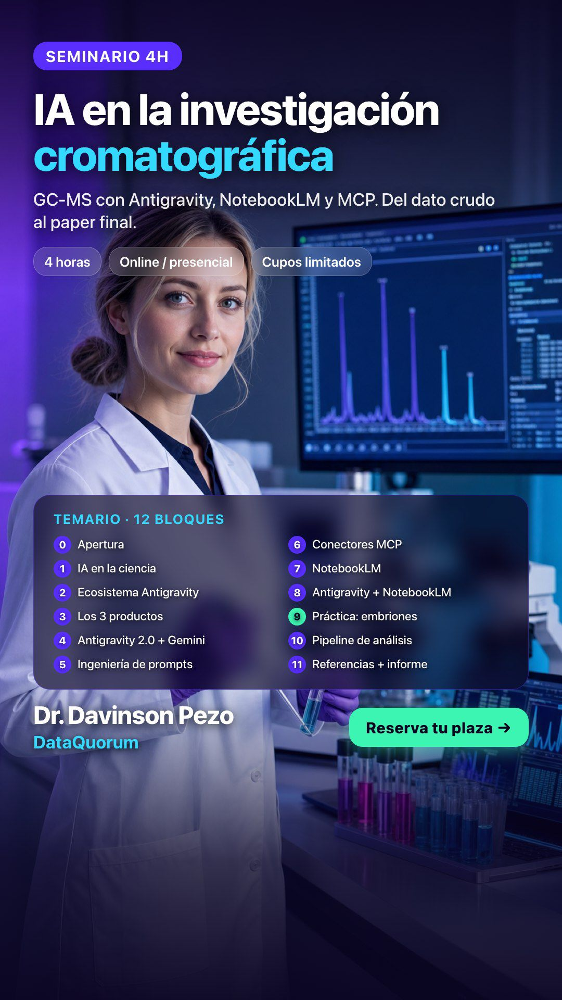

# Curso IA GC-MS

[](https://www.python.org/)
[](#que-vas-a-construir)
[](recursos.md)
[](guion-alumnos/paso4_pipeline.md)
[](LICENSE)
[](LICENSE-MIT.md)

Un curso practico para usar **IA en investigacion cromatografica**: GC-MS, cromatogramas reales, NotebookLM como RAG, Antigravity IDE como agente de trabajo y un informe tecnico como entregable final.

Este repositorio no es una carpeta de slides. Es el punto de partida para que un alumno pueda pasar de archivos cromatograficos y papers a una narrativa cientifica reproducible.

> Objetivo del curso: entender como convertir datos HS-SPME-GC-MS en un analisis defendible, con ayuda de IA, sin perder criterio quimico ni trazabilidad.

<p align="center">
  
</p>

**Abrir la presentacion:** [davinson-pezo.github.io/curso-ia-gcms](https://davinson-pezo.github.io/curso-ia-gcms/)

---

## Que Vas A Construir

Durante el curso vamos a trabajar hacia un entregable concreto:

| Entregable | Para que sirve |
| :--- | :--- |
| Presentacion guiada | Contexto, teoria, demos y flujo pedagogico del curso. |
| Dataset de trabajo | Cromatogramas GC-MS descargados desde Drive para la practica. |
| RAG bibliografico | Referencias cargadas en NotebookLM para consultar literatura durante el analisis. |
| Prompt cientifico | Instrucciones estructuradas para que un agente ejecute tareas auditables. |
| Pipeline GC-MS | Lectura, preprocesado, peak detection, alignment, PLS-DA y ranking de biomarcadores. |
| Informe tecnico | Documento final con metodologia, resultados, figuras, limitaciones y conclusiones. |

El informe de referencia es:

[informe_dataquorum_v3_final.md](informe_dataquorum_v3_final.md)

Sus imagenes estan versionadas en:

[informe_dataquorum_v3_final_images/](informe_dataquorum_v3_final_images/)

---

## Material Principal

| Recurso | Ruta |
| :--- | :--- |
| Presentacion online | [davinson-pezo.github.io/curso-ia-gcms](https://davinson-pezo.github.io/curso-ia-gcms/) |
| Codigo HTML de la presentacion | [output/presentations/index.html](output/presentations/index.html) |
| Recursos externos obligatorios | [recursos.md](recursos.md) |
| Guion para alumnos | [guion-alumnos/](guion-alumnos/) |
| Notas del orador | [markdown/notas_orador.md](markdown/notas_orador.md) |
| Material promocional | [assets/promocion/](assets/promocion/) |
| Prompts y plantillas | [recursos/](recursos/) |
| Scripts reproducibles | [scripts/](scripts/) |
| Roadmap de reconstruccion | [docs/roadmap-reconstruccion.md](docs/roadmap-reconstruccion.md) |

---

## Recursos Externos

Los archivos pesados no viven en GitHub. Antes de la practica, abre [recursos.md](recursos.md).

| Drive | Uso en clase |
| :--- | :--- |
| [Cromatogramas GC-MS](https://drive.google.com/drive/folders/1lRc_glpeQNt-PXHD4sLunmMkT75XJl2G?usp=share_link) | Datos cromatograficos con los que trabajaremos. |
| [Referencias para NotebookLM](https://drive.google.com/drive/folders/1hHobZbc4fEVaL7YF3qN5BhDrxhqBE6wB?usp=share_link) | Papers que se cargaran en NotebookLM para usarlo como RAG. |

Regla simple: **GitHub contiene guias, codigo y material docente; Drive contiene cromatogramas y referencias externas.**

---

## Quick Start

Desde la raiz del repositorio:

```bash
git clone https://github.com/davinson-pezo/curso-ia-gcms.git
cd curso-ia-gcms
```

Crear entorno Python:

```bash
python -m venv .venv
source .venv/bin/activate
pip install -r requirements.txt
```

Generar datos sinteticos para practicar sin datos reales:

```bash
python scripts/generar_datos_sinteticos.py
```

Abrir la presentacion localmente:

```bash
open output/presentations/index.html
```

En Windows o Linux, abre `output/presentations/index.html` directamente en el navegador.

---

## Ruta Del Alumno

| Paso | Guia | Resultado |
| :--- | :--- | :--- |
| 1 | [Preparacion](guion-alumnos/paso1_preparacion.md) | Entorno y repo listos. |
| 2 | [Scientific Prompt Stack](guion-alumnos/paso2_prompt_stack.md) | Prompt cientifico auditable. |
| 3 | [NotebookLM](guion-alumnos/paso3_notebooklm.md) | Base RAG con referencias del curso. |
| 4 | [Pipeline GC-MS](guion-alumnos/paso4_pipeline.md) | Analisis exploratorio y tabla de biomarcadores. |
| 5 | [Informe reproducible](guion-alumnos/paso5_informe_reproducible.md) | Informe tecnico comparable al ejemplo DataQuorum. |

---

## Bloque Practico De 90 Minutos

El corazon del curso es el **Bloque 9: Caso real de embriones bovinos**.

En ese bloque conectamos:

```text
cromatogramas GC-MS
        |
        v
preprocesado + peak detection + alignment
        |
        v
PLS-DA + VIP scores + validacion de trazas
        |
        v
NotebookLM como RAG de referencias
        |
        v
Antigravity IDE como agente de ejecucion
        |
        v
informe tecnico final
```

La meta no es que la IA "haga magia". La meta es que cada alumno pueda explicar que se hizo, con que datos, con que parametros, que se puede concluir y que todavia no se puede defender.

---

## Estructura Del Proyecto

```text
curso-ia-gcms/
├── README.md
├── recursos.md
├── requirements.txt
├── output/presentations/              Presentacion HTML del curso
├── assets/promocion/                  Imagenes para difusion del curso
├── guion-alumnos/                     Guias paso a paso para alumnos
├── recursos/                          Prompts, lecturas y datos sinteticos
├── scripts/                           Codigo reproducible
├── informe_dataquorum_v3_final.md      Informe final de referencia
├── informe_dataquorum_v3_final_images/ Figuras necesarias para el informe
├── images/                            Imagenes didacticas de la presentacion
├── markdown/                          Notas del orador
├── docs/                              Documentacion de reconstruccion
└── resultados/                        Salidas locales de alumnos
```

---

## GitHub Safety

Este repositorio esta preparado para publicarse, pero hay reglas importantes:

- No subir cromatogramas reales `.cdf`, `.CDF`, `.mzML` o `.mzXML`.
- No subir datos descargados desde Drive si contienen material privado o pesado.
- No subir resultados locales de alumnos salvo ejemplos pequenos y anonimizados.
- Revisar el informe de referencia antes de publicar: actualmente conserva marcas de confidencialidad del informe original.
- Usar Git para publicar; no subir un ZIP manual de la carpeta completa, porque puede incluir archivos ignorados.

El `.gitignore` excluye entornos virtuales, caches, `.DS_Store`, datos crudos y salidas locales.

---

## Limitaciones Actuales

- El proyecto esta en reconstruccion despues de perdida de material previo.
- La presentacion existe y es navegable, pero algunas afirmaciones sobre herramientas actuales deben revisarse antes de impartir el curso.
- El pipeline publico usa datos sinteticos; los cromatogramas reales se distribuyen por Drive.
- El informe DataQuorum sirve como objetivo estructural, pero debe sanitizarse si el repositorio sera publico para alumnos.

---

## Licencia

- Documentacion, presentaciones, imagenes y material docente: [CC BY-NC 4.0](LICENSE)
- Codigo, notebooks y configuracion tecnica: [MIT](LICENSE-MIT.md)
