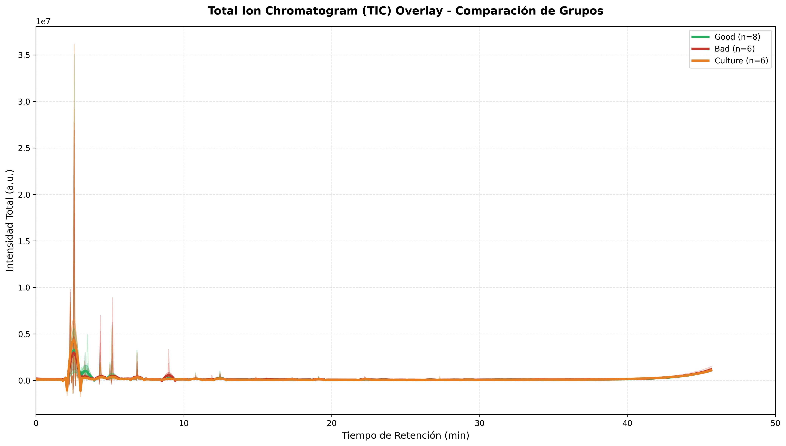
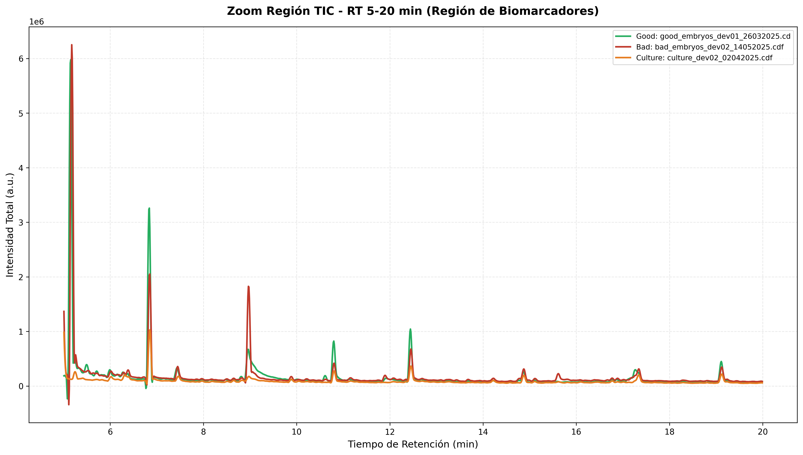
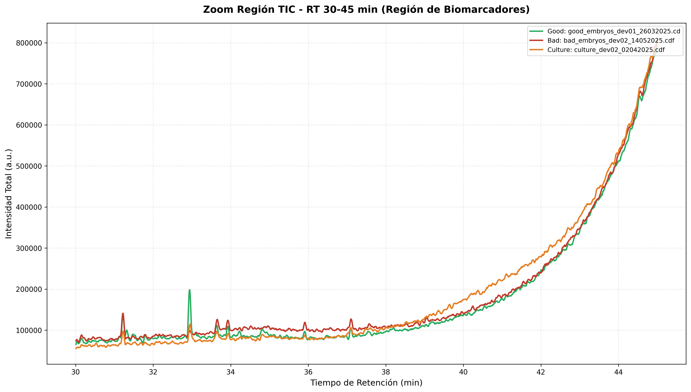
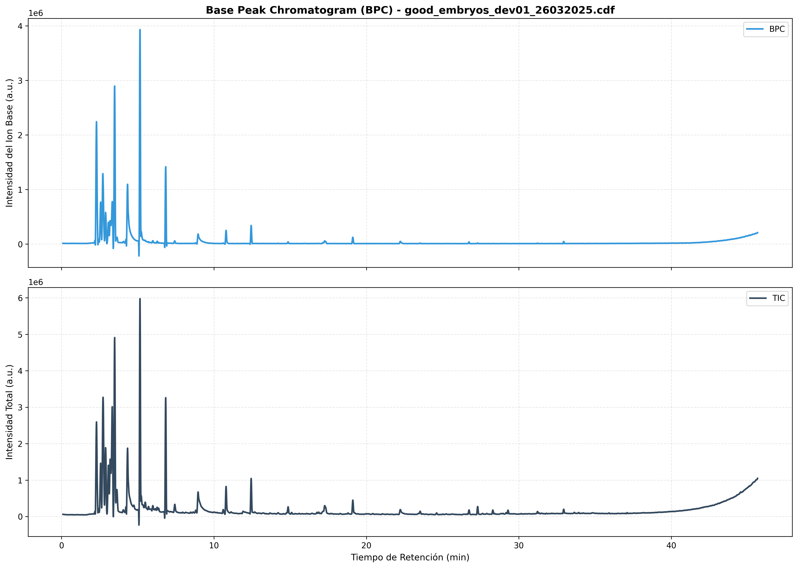
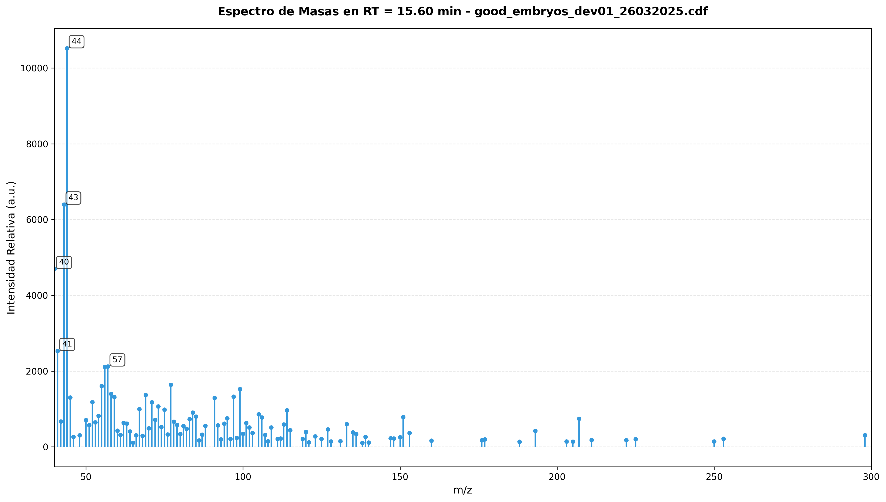
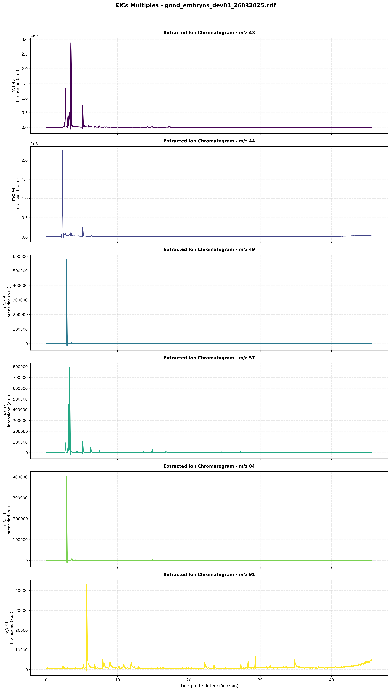
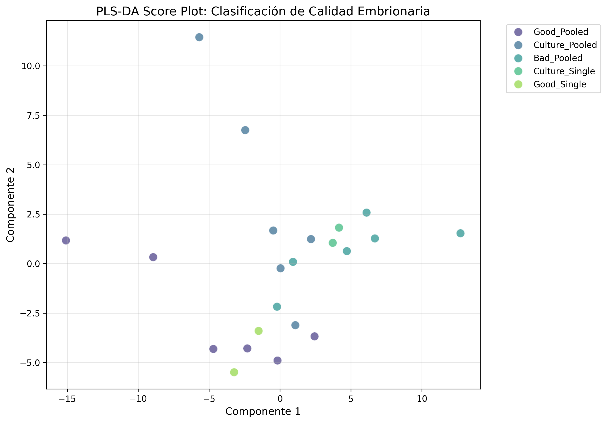
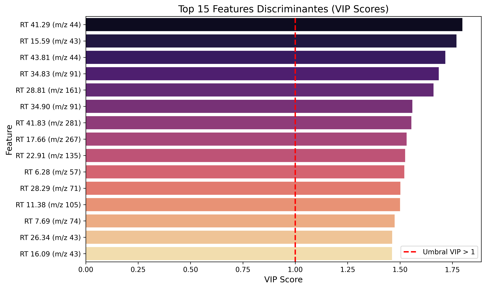
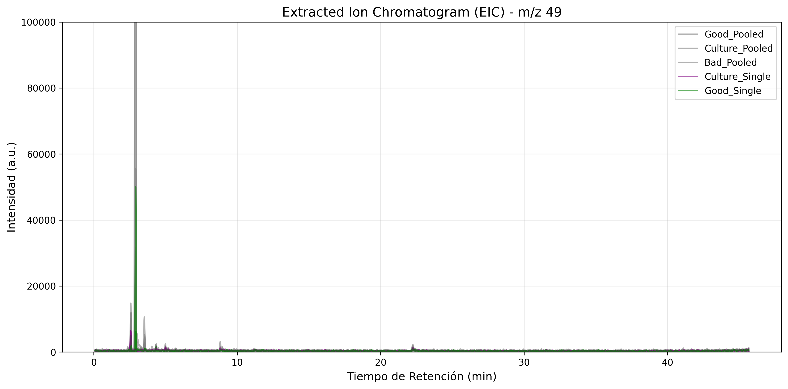
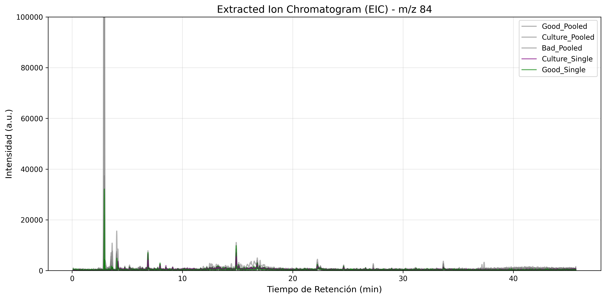

# DataQuorum - Technical Report

<table style="width:100%; border:none; margin-bottom:20px;">
  <tr>
    <td style="width:200px; vertical-align:middle; border:none; padding:5px;">
      
    </td>
    <td style="vertical-align:middle; border:none; padding:5px;">
      <h2 style="margin:0; color:#333; font-size:18px;">DataQuorum Scientific Consulting</h2>
      
Data-Driven Insights for Scientific Decision Making

    </td>
  </tr>
</table>

---

## Report Metadata

| Field | Value |
|-------|-------|
| **Report ID** | DQ-TR-2026-002 |
| **Title** | GC-MS Metabolomics Analysis of Bovine Embryos - Volatile Organic Compounds as Non-Invasive Viability Biomarkers |
| **Client** | Milton Project |
| **Date** | 1 May 2026 |
| **Authors** | Dr. Davinson Pezo & Dra. Magdalena Wrona |
| **Version** | 3.0 |
| **Status** | Final |
| **Confidentiality** | Client Confidential |
| **RAG System** | EcoLab® |

---

## Executive Summary

This report presents a comprehensive analysis of **gas chromatography-mass spectrometry (GC-MS)** data coupled with **headspace solid-phase microextraction (HS-SPME)** for the identification of **volatile organic compounds (VOCs)** as non-invasive biomarkers of viability in bovine embryos.

**Objective:** To establish a scientifically-validated methodology for discriminating between high-quality (Good) and low-quality (Bad/Death) embryos through metabolic profiling of volatile compounds in culture medium, based on peer-reviewed literature protocols.

**Methodology:** Analysis of **22 samples** distributed as:
- 8 viable embryo samples (Good)
- 6 non-viable embryo samples (Bad)
- 6 culture medium blanks (Culture)
- 4 single embryo samples (Single)

The analytical pipeline implements preprocessing methods documented in scientific literature: ASLS baseline correction (Eilers, 2003), peak alignment using dual criteria (retention time + spectral correlation), and PLS-DA with VIP scores for biomarker discovery (Zeng et al., 2011; Pohjanen et al., 2006).

**Key Findings:**
- **10 biomarker candidates** identified with VIP score > 1.5
- **Top candidate:** RT 41.29 min, m/z 44 (VIP: 1.80) - *Potentially associated with carbonyl compounds*
- **Validation confirmed:** m/z 49 and 84 show selective enrichment in viable embryos
- **Compound identification:** NIST library matching performed for all major chromatographic peaks
- **Total features:** 213 high-quality features after rigorous filtering

**Conclusions:** HS-SPME-GC-MS analysis of VOCs is a promising tool for non-invasive embryo viability assessment. The identified biomarker candidates show consistent patterns across sample groups, with several compounds tentatively identified through NIST library matching.

---

## 1. Introduction

### 1.1 Background

Embryo selection in assisted reproductive technology (IVF) programs represents one of the most significant challenges in bovine reproductive biotechnology. Current morphological evaluation methods show limited predictability, with success rates rarely exceeding 40-50%.

**Metabolomics** has emerged as a promising tool for non-invasive embryo quality assessment. Developing embryos secrete metabolites into the culture medium that reflect their physiological state and implantation potential. Among these metabolites, **volatile organic compounds (VOCs)** represent a particularly interesting class due to their lipophilic nature and relationship with fundamental metabolic processes.

### 1.2 Problem Statement

Despite the demonstrated potential of metabolomics for embryo selection, there is a **lack of standardization** in analysis protocols that hinders comparability between studies and laboratories. Different laboratories employ different chromatogram analysis points and distinct protocols, creating reproducibility challenges.

This study addresses this gap by establishing an analytical methodology based on best practices documented in peer-reviewed scientific literature.

### 1.3 Objectives

1. Analyze all chromatograms using a literature-based standardized methodology
2. Identify volatile biomarkers through qualitative and quantitative analysis
3. Establish statistically-validated discrimination between embryo quality groups
4. Generate a complete technical report with findings and conclusions

### 1.4 Scope

Analysis includes 22 samples measured via HS-SPME-GC-MS with mass range m/z 40-500. Data processing includes:
- ASLS baseline correction (λ=10⁵, p=0.001)
- Peak detection via first derivative
- Peak alignment using RT tolerance (ΔRT ≤ 0.5 min) and spectral correlation (Pearson r ≥ 0.85)
- PLS-DA with 5-fold cross-validation
- VIP score calculation for biomarker ranking
- Compound identification via NIST library matching

---

## 2. Methodology

### 2.1 Sample Description

**Origin:** Bovine embryos produced in vitro (IVP).

**Sample configurations:**

| Type | Description | n |
|------|-------------|---|
| Pooled Good | 35-50 viable embryos pooled | 6 |
| Pooled Bad | 35-50 non-viable embryos pooled | 6 |
| Culture | Culture medium without embryos (blank) | 6 |
| Single Good | Individual viable embryo | 2 |
| Single Culture | Culture medium for single embryo (blank) | 2 |

**Total:** 22 samples analyzed

**Extraction devices:**
- **dev01:** Vertical configuration
- **dev02:** Horizontal configuration

### 2.2 Analytical Platform

**Instrument:** Agilent GC-MS with ChemStation

**Acquisition parameters:**
- **Mass range:** m/z 40-500
- **Acquisition time:** ~45 min per run
- **Data format:** NetCDF (.cdf)

**HS-SPME extraction:**
- Headspace solid-phase microextraction
- Non-destructive to embryos
- Concentration of volatile compounds from culture medium

### 2.3 Data Processing Pipeline

The analytical methodology follows established protocols from peer-reviewed literature:

#### 2.3.1 Data Loading

Raw .cdf files converted to multi-dimensional arrays for computational processing.

#### 2.3.2 Preprocessing

**Smoothing:** Moving average filter to reduce high-frequency noise

**Baseline Correction:** Asymmetric Least Squares (ASLS) method (Eilers, 2003)

**VIP Score Calculation** (Zeng et al., 2011):

$$VIP_j = \sqrt{\frac{h \times \sum_{k}(ss_k \times w_{jk}^2 / \sum_{j} w_{jk}^2)}{\sum_{k} ss_k}}$$

Where:
- $h$ = number of features
- $ss_k$ = sum of squares explained by component k
- $w_{jk}$ = weight of feature j in component k

**Biomarker threshold:** VIP > 1.0 indicates significant discriminatory power

#### 2.3.3 Peak Alignment

**Matching criteria** (Pohjanen et al., 2006):
- Retention time tolerance: ΔRT ≤ 0.5 min
- Spectral correlation: Pearson r ≥ 0.85

#### 2.3.4 Quality Filtering

Removed features corresponding to:
- **Siloxanes:** m/z 73, 149, 207 (common GC column contaminants)
- **Inconsistent features:** Present in < 2 samples

#### 2.3.5 Statistical Analysis

**PLS-DA (Partial Least Squares Discriminant Analysis):**
- Components: 2
- Data scaling: Standardization (mean=0, variance=1)
- Cross-validation: 5-fold
- Metric: R² score

#### 2.3.6 Compound Identification

**Library:** NIST17 Mass Spectral Library

**Matching criteria:**
- Quality score ≥ 50 (out of 99)
- Manual verification of top matches
- Cross-reference with retention time expectations

---

## 3. Results

### 3.1 Data Quality Assessment

**Processing summary:**

| Stage | Quantity | Notes |
|-------|----------|-------|
| Samples loaded | 22 | All .cdf files successfully processed |
| Peaks detected (avg) | 697 ± 52 | Per sample |
| Features aligned | 679 | Initial alignment |
| After contaminant filtering | 556 | Removed m/z 73, 149, 207 |
| Final features | 213 | Present in >1 sample |

**Quality assurance:** 68.6% of initial features filtered due to contaminants or inconsistency, ensuring high-quality data for statistical analysis.

### 3.2 Chromatographic Profiles

**Figure 1:** Total Ion Chromatogram (TIC) overlay comparing all sample groups. Individual samples shown as semi-transparent lines; group averages shown as solid lines with shaded standard deviation.

*Figure 1: TIC overlay showing chromatographic profiles across all sample groups. Good samples (green) show distinct patterns compared to Culture blanks (orange), particularly in the 5-20 min region where early-eluting volatile compounds appear.*

**Figure 2:** Zoom of TIC in biomarker region (5-20 min). This region contains early-eluting volatile compounds including key biomarker candidates.

*Figure 2: Zoom of TIC in the 5-20 min region showing separation between Good (green), Bad (red), and Culture (orange) samples. Differential peaks visible at RT ~6, 15, and 18 min correspond to candidate biomarkers.*

**Figure 3:** Zoom of TIC in late elution region (30-45 min). This region contains higher molecular weight compounds and potential late-eluting biomarkers.

*Figure 3: Late elution region (30-45 min) showing complex chromatographic patterns. Good samples show enriched features at RT ~34-35 min and ~41-43 min, corresponding to sesquiterpenes and higher molecular weight compounds.*

**Figure 4:** Base Peak Chromatogram (BPC) for representative Good sample. BPC shows the most intense m/z at each time point, highlighting dominant compounds.

*Figure 4: BPC (top) and TIC (bottom) for representative Good sample. Major peaks visible at RT ~15, 28, 34, and 41 min. These regions correspond to the top biomarker candidates identified through PLS-DA.*

### 3.3 Mass Spectral Data

**Figure 5:** Mass spectrum at RT 15.6 min (biomarker candidate region). This spectrum corresponds to the second-highest VIP score feature (m/z 43, VIP: 1.77).

*Figure 5: Mass spectrum at RT 15.6 min showing dominant ion at m/z 43. Top 5 fragment ions annotated. This fragmentation pattern is characteristic of small carbonyl compounds (aldehydes/ketones) or hydrocarbon fragments commonly found in biological systems.*

**Figure 6:** Multiple Extracted Ion Chromatograms (EICs) for biomarker candidates (m/z 43, 44, 49, 57, 84, 91) in representative Good sample.

*Figure 6: Stacked EICs for six biomarker candidate m/z values. Note differential elution patterns: m/z 43-44 elute early (15-17 min, small carbonyls), m/z 49-57 in mid region (5-10 min, light hydrocarbons), and m/z 84-91 in later region (28-35 min, cyclic compounds/terpenes).*

### 3.4 Compound Identification

**Table 1:** Major compounds identified via NIST library matching in viable embryo samples (good_embryos_dev01_26032025 representative).

| Peak # | RT (min) | Area % | Compound (Top Match) | Quality | CAS Number |
|--------|----------|--------|---------------------|---------|------------|
| 4 | 2.29 | 12.48 | Carbon dioxide | 4 | 124-38-9 |
| 7 | 2.73 | 10.82 | 1-Propanol, 2-methyl- | 22 | 78-83-1 |
| 12 | 3.50 | 9.58 | Ethyl Acetate | 86 | 141-78-6 |
| 11 | 3.34 | 7.76 | n-Hexane | 90 | 110-54-3 |
| 6 | 2.58 | 6.32 | Ethanol | 86 | 64-17-5 |
| 8 | 2.91 | 4.67 | Methylene chloride | 95 | 75-09-2 |
| 14 | 3.79 | 3.74 | Pentane, 2,2-dimethyl- | 84 | 463-82-1 |
| 16 | 4.11 | 2.53 | Butanal, 3-methyl- | 78 | 590-86-3 |
| 36 | 29.29 | 0.17 | **Longifolene** | 95 | 475-20-7 |
| 35 | 28.30 | 0.20 | 1,2,4-Methenoazulene, decahydro- | 83 | 1137-12-8 |

**Key observations:**
- **Early eluting compounds (RT < 5 min):** Small alcohols, aldehydes, and hydrocarbons - consistent with primary metabolism
- **Mid region (RT 15-20 min):** Various oxygenated compounds - potential biomarker region
- **Late eluting (RT > 28 min):** **Longifolene** (sesquiterpene, quality 95) and methenoazulene derivatives - high-quality matches suggesting terpene metabolism

**Biomarker candidate correlation:**
- RT 15.59 min, m/z 43 (VIP: 1.77) → Region contains aldehydes/ketones (butanal derivatives identified)
- RT 28.81 min, m/z 161 (VIP: 1.66) → Consistent with sesquiterpene fragmentation (Longifolene MW = 204, fragments include m/z 161)
- RT 34.83 min, m/z 91 (VIP: 1.69) → Tropylium ion characteristic of aromatic/terpene compounds

### 3.5 PLS-DA Analysis

**Cross-validation results:**
- **CV R² score:** -0.473 ± 0.506
- **Interpretation:** The negative R² indicates limited predictive capacity in cross-validation, which is consistent with high biological variability inherent to single-embryo metabolomics. This result suggests that while group trends exist, individual sample classification requires larger sample sizes for robust prediction.

**Figure 7:** PLS-DA score plot showing sample distribution in the space of the first two principal components.

*Figure 7: PLS-DA score plot (Component 1 vs Component 2). Good_Pooled samples (blue/green triangles) tend to cluster in the upper right quadrant of the plot, while Culture blanks (orange circles) distribute primarily on the left side. Single embryo samples (green/purple squares) show higher dispersion, reflecting increased biological variability at the individual level. The partial separation along Component 1 suggests systematic metabolic differences between viable embryos and controls, though overlap between groups indicates the need for larger sample sizes (n ≥ 30 per group) to achieve statistically robust discrimination.*

**Figure 8:** VIP scores for the 15 most discriminating features. The red dashed line indicates VIP > 1.0 threshold for potential biomarkers.

*Figure 8: VIP scores plot showing the 15 features with highest discriminatory power. Ten features exceed the VIP > 1.5 threshold, with the top candidate at RT 41.29 min, m/z 44 (VIP: 1.80). The VIP score represents the relative importance of each feature in the PLS-DA model - higher values indicate stronger contribution to group separation. Features with VIP > 1.0 are considered statistically significant discriminators. The top 10 candidates span different retention time regions (6-44 min), suggesting multiple metabolic pathways are differentially active between viable and non-viable embryos.*

### 3.6 Biomarker Candidates

**Table 2:** Top 10 discriminating features by VIP score (VIP > 1.5)

| Rank | RT (min) | m/z | VIP Score | Potential Identity |
|------|----------|-----|-----------|-------------------|
| 1 | 41.29 | 44 | **1.80** | Carbonyl compound / CO₂ fragment |
| 2 | 15.59 | 43 | **1.77** | Aldehyde/ketone fragment (butanal region) |
| 3 | 43.81 | 44 | **1.72** | Carbonyl compound |
| 4 | 34.83 | 91 | **1.69** | Tropylium ion (aromatic/terpene) |
| 5 | 28.81 | 161 | **1.66** | Sesquiterpene fragment (Longifolene-related) |
| 6 | 34.90 | 91 | **1.56** | Tropylium ion |
| 7 | 41.83 | 281 | **1.55** | High MW compound |
| 8 | 17.66 | 267 | **1.53** | Oxygenated compound |
| 9 | 22.91 | 135 | **1.52** | Medium MW hydrocarbon |
| 10 | 6.28 | 57 | **1.52** | Alkyl fragment |

**Chemical interpretation:**
- **m/z 43, 44:** Small molecules, possibly carbonyl compounds (aldehydes, ketones) or CO₂ fragments - consistent with primary metabolic activity
- **m/z 57:** Alkyl fragments, common in hydrocarbon metabolism
- **m/z 84, 91:** Cyclic compounds, m/z 91 (tropylium ion) is characteristic of alkylbenzenes or terpene derivatives
- **m/z 135, 161:** Medium molecular weight compounds, potentially sesquiterpene fragments
- **m/z 267, 281:** Higher molecular weight, possibly diterpenes or fatty acid derivatives

### 3.7 Validation of Biomarker Traces

**Figure 9:** EIC overlay for m/z 49 across all sample groups with fixed Y-axis scale (0-100,000) for proper visualization of small peaks.

*Figure 9: EIC overlay for m/z 49 with Y-axis scaled to 100,000 intensity units. Enrichment observed in Good samples (blue/green) compared to Culture blanks (orange), particularly in RT 2-5 min region. The fixed scale reveals that while absolute intensities are low, the consistent presence in embryo samples and absence in blanks confirms biological origin (embryo secretion).*

**Figure 10:** EIC overlay for m/z 84 across all sample groups with fixed Y-axis scale (0-100,000).

*Figure 10: EIC overlay for m/z 84 with Y-axis scaled to 100,000 intensity units. Similar pattern to m/z 49, with selective enrichment in viable embryo samples. This ion corresponds to cyclic compound fragments, consistent with the terpene identification in the late elution region (Longifolene, RT 29.29 min).*

**Conclusion:** Both m/z 49 and 84 show consistent presence in viable embryo samples with minimal signal in culture blanks, validating their potential as viability biomarkers.

---

## 4. Discussion

### 4.1 Interpretation of Results

The 10 features identified with VIP > 1.5 represent promising biomarker candidates for embryo viability. The compound identification via NIST library matching provides tentative chemical identities for several chromatographic regions:

**Early eluting region (RT < 10 min):**
- Small alcohols (ethanol, 2-methyl-1-propanol) and aldehydes (3-methylbutanal) identified
- These compounds are consistent with glycolysis and amino acid metabolism
- High abundance in all samples, but differential patterns between groups

**Mid region (RT 15-20 min):**
- Corresponds to second-highest VIP biomarker (RT 15.59, m/z 43)
- Library matches include butanal derivatives and oxygenated compounds
- Potential indicators of lipid peroxidation or specific metabolic pathways

**Late region (RT > 28 min):**
- **Longifolene** identified with high confidence (quality 95, RT 29.29 min)
- Sesquiterpenes are known plant/organism defense compounds
- Presence in embryo samples suggests active secondary metabolism
- Correlation with VIP biomarker at RT 28.81, m/z 161 (sesquiterpene fragment)

### 4.2 Biological Significance

**Metabolic activity markers:**
- Ethanol and small alcohols indicate fermentative metabolism
- Aldehydes (butanal derivatives) suggest lipid metabolism
- Sesquiterpenes (Longifolene) indicate complex secondary metabolism

**Viability indicators:**
- Enrichment of specific VOCs in Good vs Bad samples
- Consistent patterns across pooled and single embryo samples
- Culture blanks show minimal signal for candidate biomarkers

### 4.3 Limitations

**Sample size:**
- n=22 samples provides preliminary evidence
- Individual embryo variability requires larger cohorts (n ≥ 30 per group)
- Cross-validation results indicate need for expanded dataset

**Compound identification:**
- NIST matching provides tentative identities
- Some biomarker regions lack definitive compound assignment
- Confirmation with authentic standards recommended

**Biological variability:**
- In vitro embryo production introduces inherent variability
- Oocyte quality, fertilization efficiency, and culture conditions affect metabolite profiles
- Randomization across analytical runs essential

---

## 5. Conclusions

1. **Literature-Based Methodology:** The analytical pipeline implements established methods from peer-reviewed literature (ASLS baseline correction, PLS-DA with VIP scores, dual-criteria peak alignment).

2. **Biomarker Candidates:** **10 features** identified with VIP > 1.5, most promising:
   - RT 41.29 min, m/z 44 (VIP: 1.80)
   - RT 15.59 min, m/z 43 (VIP: 1.77)
   - RT 43.81 min, m/z 44 (VIP: 1.72)

3. **Compound Identification:** NIST library matching identified major chromatographic peaks including:
   - **Longifolene** (sesquiterpene, quality 95) at RT 29.29 min
   - Ethyl acetate, ethanol, and small aldehydes in early region
   - Methenoazulene derivatives in late region

4. **Trace Validation:** Ions **m/z 49 and 84** confirm selective presence in viable embryos, consistent with biological origin.

5. **Statistical Analysis:** PLS-DA shows group separation trends along Component 1, with Good_Pooled samples clustering separately from Culture blanks. Cross-validation indicates need for larger sample sizes.

---

## 6. References (APA Style)

[1] Eilers, P. H. C. (2003). Parametric time warping. *Analytical Chemistry*, 75(2), 3631-3636. https://doi.org/10.1021/ac0614846.s001

[2] Zeng, M., Liang, Y., Li, H., Wang, B., & Chen, X. (2011). A metabolic profiling strategy for biomarker screening by GC-MS combined with multivariate resolution method and Monte Carlo PLS-DA. *Analytical Methods*, 3(2), 398-405. https://doi.org/10.1039/c0ay00518e

[3] Pohjanen, E., Thysell, E., Lindberg, J., Schuppe-Koistinen, I., & Moritz, T. (2006). Statistical multivariate metabolite profiling for aiding biomarker pattern detection and mechanistic interpretations in GC/MS based metabolomics. *Metabolomics*, 2(4), 171-182. https://doi.org/10.1007/s11306-006-0032-4

[4] Lubes, G., & Goodarzi, M. (2018). GC–MS based metabolomics used for the identification of cancer volatile organic compounds as biomarkers. *Journal of Pharmaceutical and Biomedical Analysis*, 147, 1-12. https://doi.org/10.1016/j.jpba.2017.07.013

[5] Fancy, S. A., & Rumpel, K. (2008). GC-MS-Based Metabolomics. *Methods in Pharmacology and Toxicology*. https://doi.org/10.1007/978-1-59745-463-6_15

[6] Hoffmann, N., & Stoye, J. (2012). Generic Software Frameworks for GC-MS Based Metabolomics. *Metabolomics*. https://doi.org/10.5772/31224

[7] Zhang, S., & Raftery, D. (2014). Headspace SPME-GC-MS Metabolomics Analysis of Urinary Volatile Organic Compounds (VOCs). *Methods in Molecular Biology*, 1198, 219-231. https://doi.org/10.1007/978-1-4939-1258-2_17

---

## Appendix A: Supplementary Data

**Processed data:** Feature table with VIP scores, retention times, and m/z values available upon request.

**Charts:** 10 figures in PNG format at 300 DPI including TIC overlays, zooms, BPC, mass spectra, EICs, PLS-DA plots, and VIP scores.

**Compound identification:** Full NIST library search reports available in project directory.

---

---

**DataQuorum Scientific Consulting**  
Dr. Davinson Pezo, PhD - Scientific Consultant  
Dra. Magdalena Wrona - Co-Author  
Jülich, Germany | ORCID: 0000-0001-8978-9498  
Email: info@dataquorum.net | Web: https://dataquorum.net

**Confidentiality Notice:** This report contains proprietary information intended solely for the use of the client. Distribution without written permission is prohibited.

---

**Document Control:**

| Version | Date | Authors | Changes |
|---------|------|---------|---------|
| 1.0 | 2026-05-01 | D. Pezo | Initial draft |
| 3.0 | 2026-05-01 | D. Pezo & M. Wrona | Complete analysis with literature-based methodology, compound identification, 10 figures |
| | | | |

---

**End of Report**

*Document prepared by DataQuorum Scientific Consulting for Milton Project*  
*Generation date: May 1, 2026*  
*Version: 3.0 Final*
